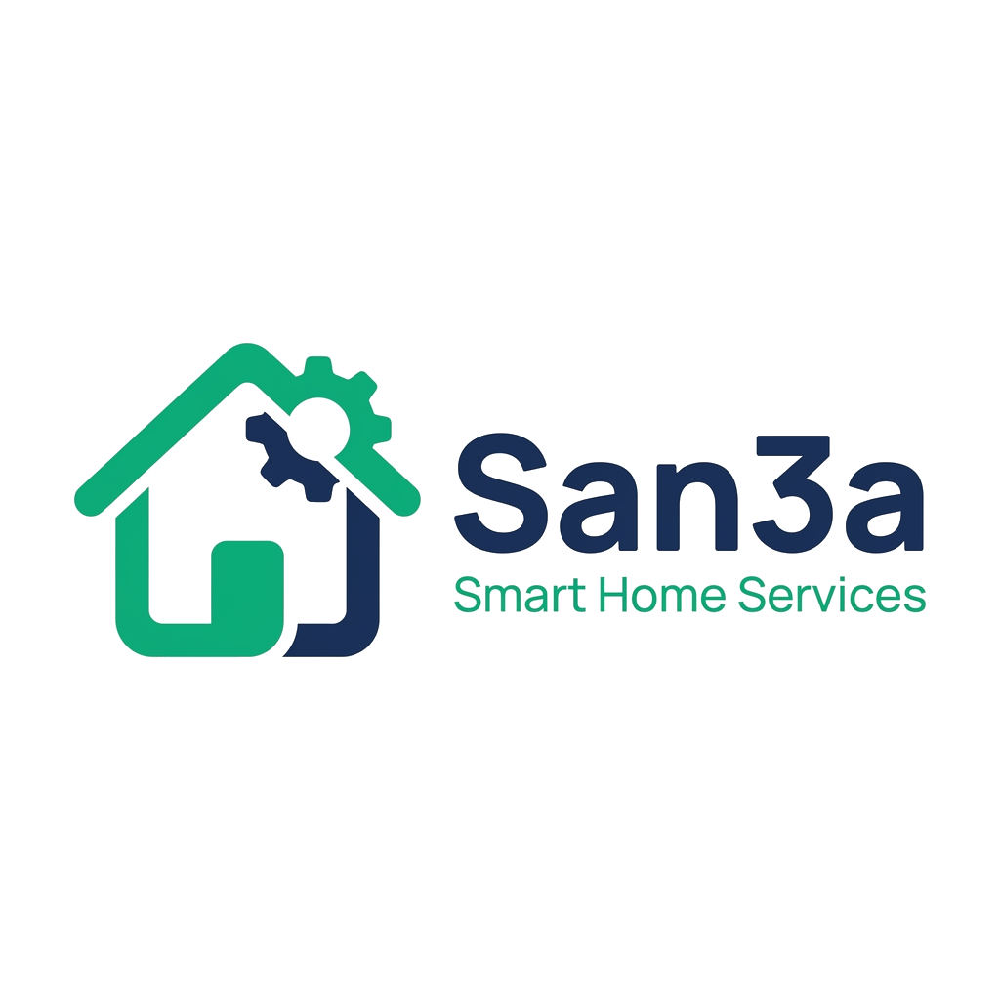
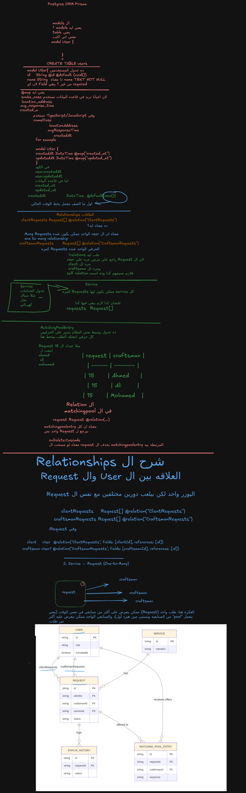

<div align="center">
  
  <h1 align="center">منصة صنعة</h1>
  <h3 align="center">San3a — Smart Home Services Platform</h3>
  <p align="center">
    <strong>ربط العملاء بأفضل الحرفيين المحترفين في مصر</strong>
    <br />
    Connecting customers with trusted, verified home service professionals
  </p>
</div>

<div align="center">


</div>

---

## 📋 Table of Contents

- [📖 About The Project](#-about-the-project)
- [✨ Features](#-features)
- [🛠️ Built With](#️-built-with)
- [📁 Project Structure](#-project-structure)
- [🚀 Getting Started](#-getting-started)
- [🔌 API Endpoints](#-api-endpoints)
- [👤 Demo Accounts](#-demo-accounts)
- [🎨 Screenshots](#-screenshots)
- [📝 License](#-license)

---

## 📖 About The Project

**صنعة** (San3a) is a full-stack web platform that connects homeowners with trusted, verified home service professionals (craftsmen) in Egypt. Users can request services like plumbing, electrical work, painting, carpentry, cleaning, and more — and get matched with the best nearby professionals in seconds.

The platform features:
- **Smart matching algorithm** based on distance, rating, response speed, and experience
- **Real-time interactive map** showing available craftsmen locations
- **Role-based dashboards** for customers, craftsmen, and admins
- **Live order tracking** with status updates (accepted → arrived → in progress → completed)
- **Cloudinary-powered profile image upload**
- **Full admin panel** for user management, disputes, and analytics

---

## ✨ Features

### 👤 Customer
- Register & login with JWT authentication
- Browse home service categories
- Request a service with location and notes
- View active requests with real-time status updates
- Track craftsman location on interactive map
- View request history
- Save favorite craftsmen
- Upload and manage profile picture
- Rate and review completed services

### 🔧 Craftsman
- Professional dashboard with earnings analytics
- Receive real-time job requests near your location
- Accept / reject incoming requests
- Update job status (accepted → arrived → in progress → completed)
- View earnings history and weekly revenue chart
- Toggle availability (online / offline)
- Manage profile and response time

### 🛡️ Admin
- Central dashboard with platform statistics
- User management (search, filter by role/status, activate/deactivate)
- Dispute resolution system
- View all platform requests with status filters
- Revenue and service distribution insights

### 🗺️ Map Features
- Interactive Leaflet map on landing page
- Real-time craftsmen markers with availability indicators
- Green markers for available, gray for offline craftsmen
- Popup with craftsman name, rating, and response time

---

## 🛠️ Built With

### Frontend
| Technology | Purpose |
|------------|---------|
| **Next.js 16** (App Router) | React framework with SSR & static generation |
| **React 19** | UI library |
| **TypeScript** | Type safety |
| **Tailwind CSS v4** | Utility-first styling |
| **Axios** | HTTP client |
| **Leaflet / react-leaflet** | Interactive maps |
| **next-cloudinary** | Image upload & optimization |
| **react-hot-toast** | Toast notifications |
| **VT323 + IBM Plex Sans Arabic** | Typography |

### Backend
| Technology | Purpose |
|------------|---------|
| **Node.js** (≥16) | Runtime environment |
| **Express 5** | Web framework |
| **MongoDB + Mongoose 9** | Database & ODM |
| **JWT (jsonwebtoken)** | Authentication |
| **bcryptjs** | Password hashing |
| **Nodemailer** | Email service |
| **validator** | Input validation |

---

## 📁 Project Structure

```
san3a-project/
├── frontend/                    # Next.js client application
│   ├── public/
│   │   ├── logo.png             # Brand logo
│   │   └── ...                  # Static assets
│   └── src/
│       ├── app/                 # Next.js App Router pages
│       │   ├── (auth)/          # Login & Register pages
│       │   ├── dashboard/       # Admin, Customer, Craftsman dashboards
│       │   ├── profile/         # Public profile pages
│       │   ├── requests/        # Request flow (new, matching, tracking, payment)
│       │   └── page.tsx         # Landing page
│       ├── components/          # Reusable UI components
│       │   ├── dashboard/       # Sidebar, etc.
│       │   ├── Map.tsx          # Interactive craftsmen map
│       │   └── Navbar.tsx       # Navigation bar
│       └── lib/
│           └── api.ts           # API helpers & auth headers
│
├── backend/                     # Express REST API
│   └── src/
│       ├── controllers/         # Route handlers (auth, dashboard, admin, etc.)
│       ├── models/              # Mongoose schemas (User, Request, Service)
│       ├── routes/              # Express routers
│       └── utils/               # Utility functions
│
├── README.md                    # You are here
└── PROJECT_DOCUMENTATION.md     # Full Arabic documentation
```

---

## 🚀 Getting Started

### Prerequisites

- **Node.js** ≥ 16.0.0
- **MongoDB** (local or Atlas)
- **npm** or **yarn**

### 1. Clone the repository

```bash
git clone https://github.com/mohamedmadyan56/SAN3A-MAIN.git
cd SAN3A-MAIN
```

### 2. Backend Setup

```bash
cd backend
npm install
```

Create a `.env` file in `backend/`:

```env
PORT=5000
MONGODB_URI=mongodb+srv://<user>:<password>@cluster.mongodb.net/san3a
JWT_SECRET=your-secret-key
JWT_EXPIRES_IN=90d
```

Then start the server:

```bash
npm run start     # Production
# or
npm run dev       # Development (with nodemon)
```

### 3. Frontend Setup

```bash
cd frontend
npm install
```

Create a `.env.local` file in `frontend/`:

```env
NEXT_PUBLIC_API_URL=http://localhost:5000/api/v1
NEXT_PUBLIC_CLOUDINARY_UPLOAD_PRESET=san3a_uploads
```

Then start the development server:

```bash
npm run dev
```

Open [http://localhost:3000](http://localhost:3000) in your browser.

---

## 🔌 API Endpoints

### Authentication
| Method | Endpoint | Description |
|--------|----------|-------------|
| POST | `/api/v1/users/signup` | Create a new account |
| POST | `/api/v1/users/login` | Login & receive JWT token |
| POST | `/api/v1/users/forgotPassword` | Request password reset |
| POST | `/api/v1/users/resetPassword/:token` | Reset password |

### Users
| Method | Endpoint | Description | Auth |
|--------|----------|-------------|------|
| GET | `/api/v1/users/craftsmen` | List all craftsmen | ✗ |
| GET | `/api/v1/users/public/:id` | Get public profile | ✗ |
| GET | `/api/v1/users/profile` | Get current user profile | ✓ |
| PATCH | `/api/v1/users/update-profile` | Update profile | ✓ |

### Dashboards
| Method | Endpoint | Description | Role |
|--------|----------|-------------|------|
| GET | `/api/v1/users/dashboard/customer` | Customer dashboard data | customer |
| GET | `/api/v1/users/dashboard/craftsman` | Craftsman dashboard data | craftsman |

### Requests
| Method | Endpoint | Description | Auth |
|--------|----------|-------------|------|
| POST | `/api/v1/requests` | Create a new request | ✓ |
| GET | `/api/v1/requests/:id` | Get request details | ✓ |
| PATCH | `/api/v1/requests/:id/status` | Update request status | ✓ |
| POST | `/api/v1/requests/:id/accept` | Accept a request | ✓ |
| POST | `/api/v1/requests/:id/reject` | Reject a request | ✓ |
| POST | `/api/v1/requests/:id/complete` | Complete a request | ✓ |

### Admin
| Method | Endpoint | Description |
|--------|----------|-------------|
| GET | `/api/v1/admin/dashboard` | Platform statistics |
| GET | `/api/v1/admin/users` | List all users |
| GET | `/api/v1/admin/users/:id` | Get user details |
| PATCH | `/api/v1/admin/users/:id` | Update user |
| DELETE | `/api/v1/admin/users/:id` | Deactivate user |
| GET | `/api/v1/admin/requests` | List all requests |
| GET | `/api/v1/admin/disputes` | List disputes |
| PATCH | `/api/v1/admin/disputes/:id/resolve` | Resolve a dispute |

---

## 👤 Demo Accounts

| Role | Email | Password |
|------|-------|----------|
| **Admin** | `admin@san3a.com` | `12345678` |
| Craftsman | `ahmed@san3a.com` | `12345678` |
| Craftsman | `mohamed@san3a.com` | `12345678` |
| Craftsman | `ali@san3a.com` | `12345678` |
| Craftsman | `mahmoud@san3a.com` | `12345678` |
| Customer | `customer1@san3a.com` | `12345678` |
| Customer | `customer2@san3a.com` | `12345678` |
| Customer | `customer3@san3a.com` | `12345678` |

---

## 🎨 Screenshots

> *Coming soon — add screenshots of the landing page, dashboards, map, and request flow to a `screenshots/` folder.*

| Page | Preview |
|------|---------|
| **ORM Model** |  |
| **Landing Page** |  |
| **Customer Dashboard** |  |
| **Craftsman Dashboard** |  |
| **Admin Panel** |  |
| **Interactive Map** |  |

---

## 📝 License

Distributed under the ISC License. See `LICENSE` for more information.

---

<div align="center">
  <strong>Made with ❤️ in Egypt</strong>
  <br />
  <a href="https://github.com/mohamedmadyan56">@mohamedmadyan56</a>
</div>
